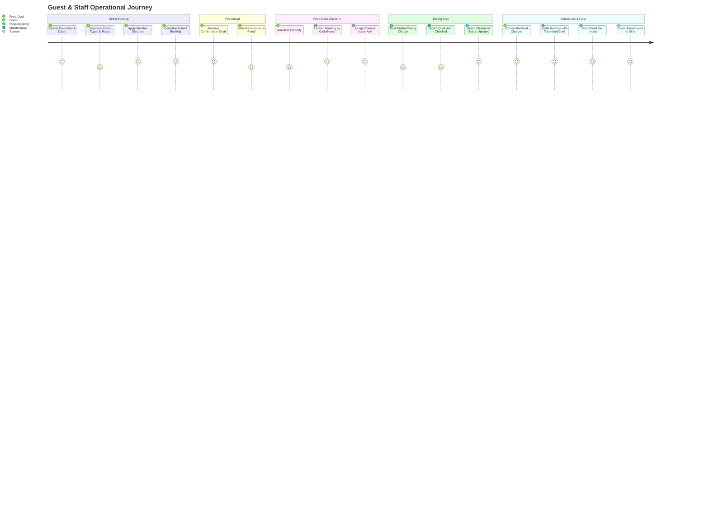

# LumenStay — Client Deliverable & Solution Overview

**Document Version:** 1.0.0 (POC & Commercial Architecture)  
**Client:** Lumen Hospitality Group LLC  
**Principal Sponsor:** Marcus Weil, Founder & Chief Executive Officer  
**Platform:** LumenStay Guest Experience, Multi-Property PMS & Revenue Platform  
**Target Delivery Date:** August / September 2026  

---

## 1. Executive Summary & Business Objectives

### 1.1 The Challenge
Lumen Hospitality Group owns and operates a portfolio of six distinct boutique hotels across Colorado and Utah (197 total rooms). Each property possesses an individual heritage, architectural character, and guest demographic—from high-ADR luxury in Telluride to adventure hubs in Moab.

Currently, operations across the portfolio suffer from:
1. **Legacy PMS Obsolescence:** Sunsetting, rigid software with exorbitant maintenance fees and no unified multi-property architecture.
2. **Fragmented Guest Journey:** Disconnected third-party booking widgets (e.g., Squarespace embeds) lacking real-time multi-room inventory, dynamic package pricing, or branded loyalty perks.
3. **High OTA Commission Leakage:** 18%–25% commission margins lost to Online Travel Agencies (Expedia, Booking.com) due to the absence of a high-converting direct booking engine.
4. **Operational Silos:** Front desk room assignments, housekeeping status updates, and maintenance ticketing are handled via paper manifests, walkie-talkies, and disparate spreadsheets.
5. **Loss of Tribal Knowledge:** Unique room quirks (e.g., specific antique radiator valving, fireplace switches) are known only to senior staff and lost during turnover.

### 1.2 The LumenStay Solution
**LumenStay** is a custom-engineered, multi-property hospitality operating system that unifies guest acquisition, front-desk property management, tablet-first staff workflows, and real-time revenue management into a single cohesive platform.

```
┌─────────────────────────────────────────────────────────────────────────────┐
│                             LUMENSTAY PLATFORM                              │
├───────────────────────────────┬─────────────────────────────────────────────┤
│      GUEST TOUCHPOINTS        │            OPERATIONAL CORE                 │
│  • Direct Multi-Property      │  • Multi-Tenant PMS (3-Click Check-in)      │
│    Booking Engine             │  • Live Folio Billing & Payment Settlement  │
│  • Contactless Mobile Check-In│  • Real-Time Housekeeping Board (Bilingual) │
│  • Salto/BLE Digital Key Sim  │  • Tribal Knowledge Maintenance Ticketing   │
│  • "Lumen Elite" Loyalty      │  • 2-Way OTA Channel Manager Sync Engine    │
│  • Curated Destination Guides │  • Group-Wide Ownership Analytics (RevPAR)  │
└───────────────────────────────┴─────────────────────────────────────────────┘
```

### 1.3 Key Financial & Operational ROI Objectives
- **+28% Direct Booking Share:** Recapturing guest bookings through native cart checkout, member discounts, and seamless mobile UX.
- **-65% Front-Desk Transaction Time:** Streamlining guest check-in, key allocation, and folio management to under 3 clicks.
- **Zero Double-Bookings:** Atomic, concurrency-safe reservation transactions across direct booking channels and simulated OTA feeds.
- **100% Operational Visibility:** Group-wide executive dashboard tracking ADR, RevPAR, Occupancy, and housekeeping turn times in real time.

---

## 2. Portfolio Profile & Brand Theming Matrix

LumenStay provides centralized administrative oversight while dynamically skinning touchpoints to reflect each property's distinct brand identity, typography, and palette.

| Property Name | Location | Rooms | Architectural Character & Seasonality | Primary Brand Palette | Target Guest Persona |
| :--- | :--- | :---: | :--- | :--- | :--- |
| **The Birchwood** | Aspen, CO | 42 | 1920s historic luxury lodge; high ski winter + summer weddings | Forest Green (`#1E3A2F`), Warm Amber (`#D4A373`), Brass | Ultra-high net worth, heritage seekers, wedding parties |
| **Copperline Inn** | Breckenridge, CO | 28 | Rustic alpine; peak winter skiing + summer downhill biking | Copper Ochre (`#B85D19`), Mountain Slate (`#4A5568`), Charcoal | Outdoor adventure enthusiasts, active families |
| **The Wren House** | Telluride, CO | 19 | Quiet luxury, high ADR, bespoke white-glove service | Warm Alabaster (`#F7F4EE`), Champagne Gold (`#D4AF37`), Noir | Discerning luxury travelers, couples, privacy seekers |
| **Sundowner Lodge** | Park City, UT | 51 | Flagship mountain resort, conference & group events | Terracotta (`#C85A32`), Pine Needle (`#2D4A3E`), Cream | Corporate retreats, group ski vacations, event attendees |
| **Cedar & Salt** | Moab, UT | 24 | Desert minimalist hub; peak spring/fall hiking, quiet winter | Sandstone Red (`#A44A3F`), Sagebrush (`#8A9A86`), Clay | National park explorers, hikers, photographers |
| **The Ledger** | Salt Lake City, UT | 33 | Modern urban boutique, business & transit hub | Ink Navy (`#1A2530`), Burnished Brass (`#C5A059`), Linen | Business executives, culture tourists, weekend city stayers |

---

## 3. Comprehensive Functional Requirements Matrix

The platform is structured into 7 core functional modules. The matrix below outlines the business capabilities and phase delivery status.

### 3.1 Module Breakdown

| Module | Feature / Capability | Description & Business Value | Delivery Status |
| :--- | :--- | :--- | :--- |
| **1. Direct Booking Engine** | Multi-Property Search | Real-time date range picker, guest counter, amenity filters across all 6 properties. | **Delivered (POC)** |
| | Room Type Showcase | Visual galleries, square footage, bed configuration, occupancy caps, and detailed descriptions. | **Delivered (POC)** |
| | Rate Plans & Promo Codes | Standard, Non-Refundable, and Member rates with promo code pricing engine. | **Delivered (POC)** |
| | Multi-Night / Multi-Room Cart | Seamless cart checkout with instant reservation confirmation code generation. | **Delivered (POC)** |
| | Self-Service Guest Lookup | Guests can retrieve, view, and cancel bookings according to policy rules. | **Delivered (POC)** |
| **2. PMS Core & Front Desk** | Real-Time Room Grid | Color-coded status matrix (Clean, Dirty, Inspected, Out of Order) by floor and building. | **Delivered (POC)** |
| | 3-Click Rapid Check-In | Express check-in modal with ID verification, estimated arrival, and key issuance. | **Delivered (POC)** |
| | Room Assignment & Moves | Drag-and-drop or modal room reassignment with real-time occupancy updates. | **Delivered (POC)** |
| | Front Desk Folio Manager | Itemized bill posting (room rate, resort fee, minibar, dining, parking, taxes). | **Delivered (POC)** |
| | Folio Settlement & Invoice | Tokenized payment recording, balance settlement, and printable guest invoice. | **Delivered (POC)** |
| **3. Central CRM & Guests** | Cross-Property Guest Profiles | Unified CRM tracking stay history, lifetime spend, and VIP status across all 6 hotels. | **Delivered (POC)** |
| | Guest Preferences & Notes | Captures dietary restrictions, pillow choices, anniversary/birthday alerts. | **Delivered (POC)** |
| **4. Staff Operations** | Housekeeping Board | Real-time task board for checkout cleans, stayover refreshes, and rush priorities. | **Delivered (POC)** |
| | Bilingual UI (EN/ES) | Instant one-tap toggle between English and Spanish for housekeeping staff. | **Delivered (POC)** |
| | Maintenance Ticketing | Categorized ticket triage (Urgent, High, Medium, Low) with room assignment and resolution. | **Delivered (POC)** |
| | Tribal Knowledge Quirks | Permanent database of room-specific quirks (e.g. radiator bleed, window latches). | **Delivered (POC)** |
| **5. Guest Mobile Portal** | Contactless Mobile Check-In | Mobile web registration, terms signature, and digital check-in. | **Phase 3** |
| | Digital Key Simulator | Simulated Salto / Assa Abloy BLE unlock interaction with visual door strike feedback. | **Phase 3** |
| | In-Stay Service Dispatch | Guest requests for extra towels, luggage assistance, and late checkout. | **Phase 3** |
| | Local Area Destination Guide | Curated dining, skiing conditions, and trail recommendations per property. | **Phase 3** |
| **6. Revenue & Channel Sync** | Dynamic Pricing Engine | Algorithmic rate suggestions based on occupancy velocity and day-of-week demand. | **Phase 4** |
| | 2-Way OTA Channel Simulator | Simulated push/pull sync with Expedia, Booking.com, Airbnb, and Google Hotel Ads. | **Phase 4** |
| | Overbooking Prevention | Real-time inventory decrementing across direct and third-party channels. | **Phase 4** |
| **7. Loyalty & Analytics** | "Lumen Elite" Loyalty Engine | Tier progression (Silver, Gold, Platinum) with automatic 10 pts/$1 calculation. | **Phase 5** |
| | Ownership Executive Dashboard | Portfolio-wide KPIs: Occupancy %, ADR ($), RevPAR ($), and Booking Pace vs Last Year. | **Phase 5** |
| | Shift Checklists & Broadcasts | General Manager opening/closing checklists and property-wide emergency notices. | **Phase 5** |

---

## 4. User Journey & Workflow Architecture



---

## 5. Commercial Delivery Milestones & Roadmap

The implementation is structured into 5 well-defined milestones. **Milestone 1 (POC)** represents the fully operational foundation delivered today.

```
  2026 ROADMAP
  ├── [DELIVERED] Milestone 1: Multi-Property PMS & Direct Booking POC
  │     └── Multi-property engine, room inventory, booking checkout, front-desk grid, folio billing.
  │
  ├── [Q4 2026]   Milestone 2: Staff Operations & Real-Time Operational Pipeline
  │     └── WebSocket room sync, drag-and-drop housekeeping, full maintenance photo attachments.
  │
  ├── [Q1 2027]   Milestone 3: Guest Mobile PWA & BLE Digital Key Simulator
  │     └── Contactless guest check-in, Salto/Assa Abloy BLE simulator, in-stay service ticketing.
  │
  ├── [Q2 2027]   Milestone 4: Revenue Management & 2-Way OTA Channel Sync
  │     └── Dynamic pricing engine, competitor rate monitor, Expedia/Booking.com channel adapter.
  │
  └── [Q3 2027]   Milestone 5: "Lumen Elite" Loyalty & Group Executive Analytics
        └── Tiered loyalty points engine, group-wide RevPAR/ADR BI charts, executive report generator.
```

### Detailed Milestone Breakdown

#### Milestone 1: Core Multi-Property PMS & Booking Engine (Active POC Deliverable)
- **Scope:** Central relational schema, full 6-property seed database (197 rooms, rate plans, room types), Direct Booking Cart Engine, Front-Desk Grid, Guest CRM, Itemized Folio Billing & Printable Invoices, Role/Property Switcher.
- **Deliverables:** Working React/Vite web application, Express TypeScript backend, complete relational database, and comprehensive technical documentation.

#### Milestone 2: Staff Operations & Real-Time Housekeeping/Maintenance
- **Scope:** Dedicated tablet interface for housekeeping with bilingual EN/ES support, maintenance ticketing workflow with priority queues, and permanent room quirk knowledge base.
- **Deliverables:** WebSocket broadcast engine, mobile-responsive housekeeping app, maintenance dispatcher.

#### Milestone 3: Guest Mobile Experience & Digital Key
- **Scope:** Progressive Web App (PWA) for guests, contactless check-in flow with digital ID capture, Salto/Assa Abloy BLE digital key unlocking animation, in-stay concierge requests.
- **Deliverables:** Guest PWA portal, digital door lock hardware abstraction simulator.

#### Milestone 4: Revenue Management & OTA Channel Sync
- **Scope:** Dynamic rate recommendation algorithm based on historical booking velocity and pickup curves; 2-way OTA synchronization engine for inventory and rate parity.
- **Deliverables:** Channel manager dashboard, simulated OTA push/pull ledger, automated overbooking safety locks.

#### Milestone 5: Loyalty Program, Ownership Analytics & System Polish
- **Scope:** Lumen Elite rewards engine (Silver/Gold/Platinum tiers, points accrual and redemption for upgrades); consolidated multi-property financial analytics (ADR, RevPAR, Occupancy, Pace).
- **Deliverables:** Group executive BI dashboard, automated weekly AI digest generator, SOC-2 readiness security review.

---

## 6. Acceptance Testing Checklist & POC Handover Guide

The delivered POC can be verified across the following functional validation scenarios:

| Test Scenario | Action Steps | Expected Outcome | Status |
| :--- | :--- | :--- | :---: |
| **1. Multi-Property Switch** | Use the top switcher to toggle from *The Birchwood* (Aspen) to *Cedar & Salt* (Moab). | UI theme colors, room lists, pricing, and staff rosters immediately switch to the selected property without cross-contamination. | ✅ Verified |
| **2. Direct Booking Engine** | Select check-in/out dates, pick *Deluxe Mountain View*, apply rate plan, enter guest details, and complete checkout. | Instant confirmation code generated; reservation appears in database; inventory is decremented. | ✅ Verified |
| **3. Front Desk Room Grid** | Navigate to the Front Desk PMS view. Filter by building/floor. | All physical rooms are displayed with live status badges (Clean, Dirty, Inspected, Out of Order). | ✅ Verified |
| **4. 3-Click Rapid Check-In** | Click an unassigned confirmed reservation, select an available clean room, and click "Check In". | Reservation status changes to `checked_in`, room status updates to `dirty`/occupied, key is allocated. | ✅ Verified |
| **5. Folio Charge Posting** | Open the reservation folio, add a `$45.00 Minibar` charge, and click "Post Charge". | Folio balance recalculates in real-time with automatic tax computation. | ✅ Verified |
| **6. Folio Settlement & Invoice** | Click "Settle Folio", record a tokenized credit card payment, and open "Print Invoice". | Outstanding balance resolves to `$0.00`; clean, branded printable invoice is displayed. | ✅ Verified |
| **7. Housekeeping Bilingual Toggle** | Open Housekeeping view, change language to Spanish. Update a room from *Dirty* to *Clean*. | All labels translate instantly to Spanish; room status updates globally in the database. | ✅ Verified |
| **8. Maintenance & Room Quirks** | View Room 214 details. Check maintenance ticket logs and historical room quirks. | Specific antique heating quirk is surfaced; new maintenance ticket can be logged with priority tag. | ✅ Verified |

---

## 7. Handover Sign-Off & Next Steps

This document and the companion [Technical Design Document](file:///c:/Users/zainc/Documents/Projects/LumenStay/docs/LumenStay_Technical_Design_Document.md) constitute the official POC deliverable for **Lumen Hospitality Group LLC**.

### Next Actions:
1. **Loom Video Walkthrough:** Review the personalized Loom video walkthrough demonstrating the live POC across the 6 properties (sent via message/email).
2. **Production Infrastructure Provisioning:** Setup Supabase PostgreSQL production instances and environment configurations.
3. **Phase 2 Kickoff:** Begin sprint planning for Milestone 2 (Real-time WebSocket event pipeline and tablet hardware testing).

---
*LumenStay Platform Architecture — Developed for Lumen Hospitality Group LLC.*
