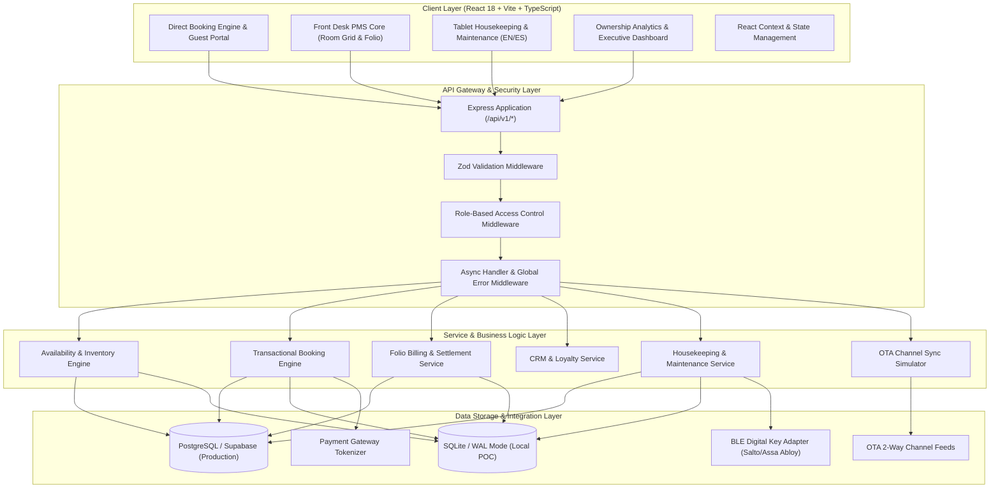
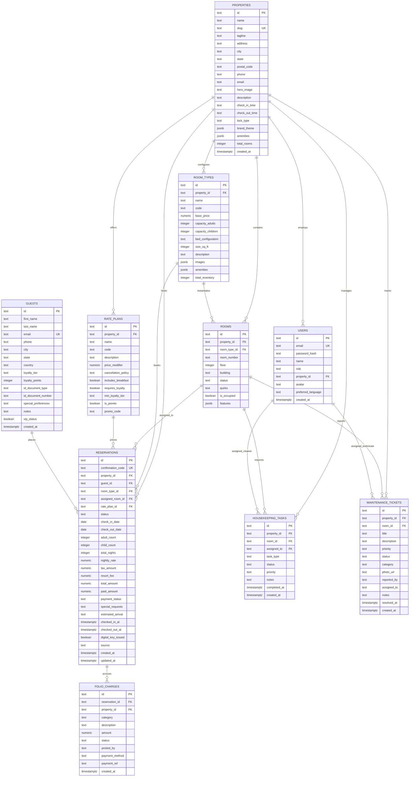
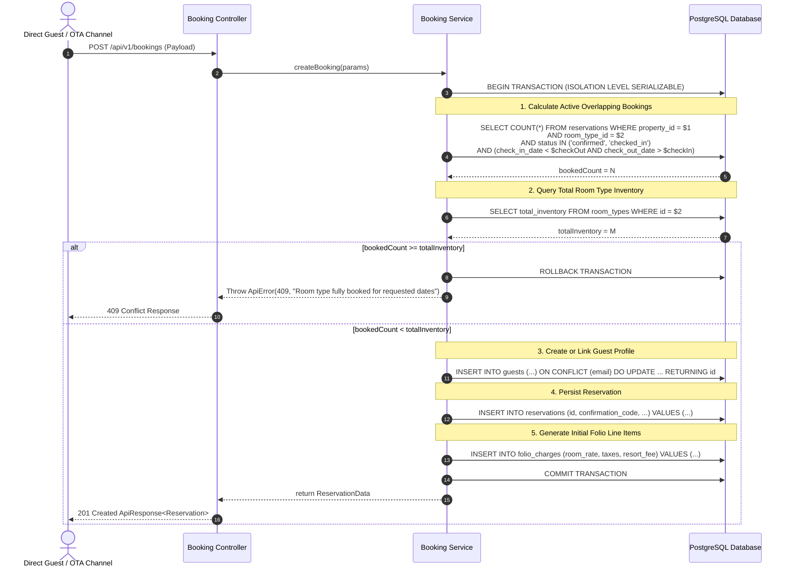

# LumenStay — Technical Design Document (TDD)

> 💡 **Interactive View Available:** An interactive, styled HTML version of this technical design with live Mermaid diagrams, collapsible endpoint specs, and syntax highlighting is available at **[LumenStay_Technical_Design_Document.html](file:///c:/Users/zainc/Documents/Projects/LumenStay/docs/LumenStay_Technical_Design_Document.html)**.

**Document Version:** 1.0.0  
**Project:** LumenStay Multi-Property PMS, Direct Booking & Revenue Platform  
**Target Environment:** Local POC (Node.js/Express + SQLite) / Production Target (Node.js/Express + PostgreSQL / Supabase)  
**Security Standard:** Strict TypeScript, Zod Schema Validation, Atomic Relational Transactions, Role-Based Access Control (RBAC)  

---

## 1. System Architecture Overview

LumenStay is architected as a modular, decoupled web application. The frontend leverages React 18+ and Vite for a reactive, component-driven client. The backend provides a strictly typed RESTful API layer with transactional integrity, centralized error handling, and unified response envelopes.



---

## 2. Entity Relationship Diagram (Mermaid ERD)

The relational schema strictly enforces referential integrity, foreign key cascades, and date-range overlap constraints.



---

## 3. Database Schema & Data Dictionary

### 3.1 PostgreSQL / Supabase Schema Definition

```sql
-- Core Table Definitions with Constraints
CREATE TABLE properties (
  id TEXT PRIMARY KEY,
  name TEXT NOT NULL,
  slug TEXT NOT NULL UNIQUE,
  tagline TEXT NOT NULL,
  address TEXT NOT NULL,
  city TEXT NOT NULL,
  state TEXT NOT NULL,
  postal_code TEXT NOT NULL,
  phone TEXT NOT NULL,
  email TEXT NOT NULL,
  hero_image TEXT NOT NULL,
  description TEXT NOT NULL,
  check_in_time TEXT NOT NULL DEFAULT '15:00',
  check_out_time TEXT NOT NULL DEFAULT '11:00',
  lock_type TEXT NOT NULL DEFAULT 'salto',
  brand_theme JSONB NOT NULL,
  amenities JSONB NOT NULL DEFAULT '[]'::jsonb,
  total_rooms INTEGER NOT NULL DEFAULT 0,
  created_at TIMESTAMPTZ NOT NULL DEFAULT NOW()
);

CREATE TABLE room_types (
  id TEXT PRIMARY KEY,
  property_id TEXT NOT NULL REFERENCES properties(id) ON DELETE CASCADE,
  name TEXT NOT NULL,
  code TEXT NOT NULL,
  base_price NUMERIC(10, 2) NOT NULL,
  capacity_adults INTEGER NOT NULL DEFAULT 2,
  capacity_children INTEGER NOT NULL DEFAULT 1,
  bed_configuration TEXT NOT NULL,
  size_sq_ft INTEGER NOT NULL,
  description TEXT NOT NULL,
  images JSONB NOT NULL DEFAULT '[]'::jsonb,
  amenities JSONB NOT NULL DEFAULT '[]'::jsonb,
  total_inventory INTEGER NOT NULL DEFAULT 1
);

CREATE TABLE rooms (
  id TEXT PRIMARY KEY,
  property_id TEXT NOT NULL REFERENCES properties(id) ON DELETE CASCADE,
  room_type_id TEXT NOT NULL REFERENCES room_types(id) ON DELETE CASCADE,
  room_number TEXT NOT NULL,
  floor INTEGER NOT NULL DEFAULT 1,
  building TEXT NOT NULL DEFAULT 'Main Lodge',
  status TEXT NOT NULL DEFAULT 'clean' CHECK (status IN ('clean', 'dirty', 'inspected', 'out_of_order')),
  quirks TEXT,
  is_occupied BOOLEAN NOT NULL DEFAULT FALSE,
  features JSONB DEFAULT '[]'::jsonb,
  UNIQUE (property_id, room_number)
);

CREATE TABLE rate_plans (
  id TEXT PRIMARY KEY,
  property_id TEXT NOT NULL REFERENCES properties(id) ON DELETE CASCADE,
  name TEXT NOT NULL,
  code TEXT NOT NULL,
  description TEXT NOT NULL,
  price_modifier NUMERIC(5, 2) NOT NULL DEFAULT 1.0,
  cancellation_policy TEXT NOT NULL,
  includes_breakfast BOOLEAN NOT NULL DEFAULT FALSE,
  requires_loyalty BOOLEAN NOT NULL DEFAULT FALSE,
  min_loyalty_tier TEXT,
  is_promo BOOLEAN NOT NULL DEFAULT FALSE,
  promo_code TEXT
);

CREATE TABLE guests (
  id TEXT PRIMARY KEY,
  first_name TEXT NOT NULL,
  last_name TEXT NOT NULL,
  email TEXT NOT NULL UNIQUE,
  phone TEXT NOT NULL,
  city TEXT,
  state TEXT,
  country TEXT DEFAULT 'USA',
  loyalty_tier TEXT NOT NULL DEFAULT 'member' CHECK (loyalty_tier IN ('member', 'silver', 'gold', 'platinum')),
  loyalty_points INTEGER NOT NULL DEFAULT 0,
  id_document_type TEXT,
  id_document_number TEXT,
  special_preferences TEXT,
  notes TEXT,
  vip_status BOOLEAN NOT NULL DEFAULT FALSE,
  created_at TIMESTAMPTZ NOT NULL DEFAULT NOW()
);

CREATE TABLE reservations (
  id TEXT PRIMARY KEY,
  confirmation_code TEXT NOT NULL UNIQUE,
  property_id TEXT NOT NULL REFERENCES properties(id),
  guest_id TEXT NOT NULL REFERENCES guests(id),
  room_type_id TEXT NOT NULL REFERENCES room_types(id),
  assigned_room_id TEXT REFERENCES rooms(id),
  rate_plan_id TEXT NOT NULL REFERENCES rate_plans(id),
  status TEXT NOT NULL DEFAULT 'confirmed' CHECK (status IN ('confirmed', 'checked_in', 'checked_out', 'cancelled', 'no_show')),
  check_in_date DATE NOT NULL,
  check_out_date DATE NOT NULL,
  adult_count INTEGER NOT NULL DEFAULT 2,
  child_count INTEGER NOT NULL DEFAULT 0,
  total_nights INTEGER NOT NULL DEFAULT 1,
  nightly_rate NUMERIC(10, 2) NOT NULL,
  tax_amount NUMERIC(10, 2) NOT NULL DEFAULT 0,
  resort_fee NUMERIC(10, 2) NOT NULL DEFAULT 0,
  total_amount NUMERIC(10, 2) NOT NULL,
  paid_amount NUMERIC(10, 2) NOT NULL DEFAULT 0,
  payment_status TEXT NOT NULL DEFAULT 'authorized' CHECK (payment_status IN ('pending', 'authorized', 'paid', 'refunded')),
  special_requests TEXT,
  estimated_arrival TEXT DEFAULT '15:00',
  checked_in_at TIMESTAMPTZ,
  checked_out_at TIMESTAMPTZ,
  digital_key_issued BOOLEAN NOT NULL DEFAULT FALSE,
  source TEXT NOT NULL DEFAULT 'direct',
  created_at TIMESTAMPTZ NOT NULL DEFAULT NOW(),
  updated_at TIMESTAMPTZ NOT NULL DEFAULT NOW()
);

CREATE TABLE folio_charges (
  id TEXT PRIMARY KEY,
  reservation_id TEXT NOT NULL REFERENCES reservations(id) ON DELETE CASCADE,
  property_id TEXT NOT NULL REFERENCES properties(id),
  category TEXT NOT NULL CHECK (category IN ('room_rate', 'tax', 'resort_fee', 'minibar', 'dining', 'spa', 'parking', 'late_checkout', 'adjustment', 'payment')),
  description TEXT NOT NULL,
  amount NUMERIC(10, 2) NOT NULL,
  status TEXT NOT NULL DEFAULT 'posted' CHECK (status IN ('posted', 'void', 'paid')),
  posted_by TEXT NOT NULL DEFAULT 'System',
  payment_method TEXT,
  payment_ref TEXT,
  created_at TIMESTAMPTZ NOT NULL DEFAULT NOW()
);

-- Performance Indexing
CREATE INDEX idx_reservations_dates ON reservations (property_id, room_type_id, status, check_in_date, check_out_date);
CREATE INDEX idx_rooms_property ON rooms (property_id, room_type_id, status);
CREATE INDEX idx_folio_reservation ON folio_charges (reservation_id);
```

---

## 4. Transactional Booking Engine & Concurrency Model

### 4.1 The Overbooking Prevention Problem
In a hospitality reservation platform, multiple guests or OTA sync channels may attempt to book the last available room of a specific type simultaneously. A non-transactional system that reads availability in Step 1 and writes the booking in Step 2 suffers from race conditions leading to illegal overbooking.

### 4.2 Concurrency-Safe Algorithm
LumenStay executes availability validation and booking reservation within an **atomic database transaction** (`BEGIN IMMEDIATE` in SQLite, `SERIALIZABLE` or `FOR UPDATE` in PostgreSQL):



### 4.3 Date-Range Overlap Math
A reservation overlap occurs if and only if:
$$\text{Existing.CheckIn} < \text{Requested.CheckOut} \quad \text{AND} \quad \text{Existing.CheckOut} > \text{Requested.CheckIn}$$
Exact equality on same-day changeover ($\text{Existing.CheckOut} = \text{Requested.CheckIn}$) is non-overlapping, allowing a guest to check into a room on the afternoon of another guest's morning departure.

---

## 5. Comprehensive REST API Specifications

All endpoints are versioned under `/api/v1/`. Responses strictly conform to standard envelopes.

### 5.1 Standard Response Envelopes

#### Success Envelope (`200 OK`, `201 Created`)
```json
{
  "success": true,
  "message": "Reservation created successfully",
  "data": { ... }
}
```

#### Error Envelope (`400 Bad Request`, `404 Not Found`, `409 Conflict`, `500 Server Error`)
```json
{
  "success": false,
  "message": "Room type not available for selected dates",
  "errors": [
    {
      "field": "check_in_date",
      "message": "Check-in date cannot be in the past"
    }
  ]
}
```

---

### 5.2 Property Management Endpoints

#### `GET /api/v1/properties`
Fetches all 6 properties with summaries, brand metadata, and active room counts.
- **Access:** Public / All Roles
- **Response `data`:** Array of `Property` objects.

#### `GET /api/v1/properties/:id`
Fetches detailed profile of a single property including all room types and rate plans.
- **Access:** Public / All Roles
- **Path Parameter:** `id` (e.g. `prop-birchwood`)

---

### 5.3 Availability & Search Endpoints

#### `GET /api/v1/availability`
Calculates available inventory and rates across room types for given stay dates.
- **Access:** Public
- **Query Parameters (Zod Validated):**
  - `propertyId` (string, required): Property identifier.
  - `checkIn` (string, required): `YYYY-MM-DD`
  - `checkOut` (string, required): `YYYY-MM-DD` (must be $> \text{checkIn}$)
  - `adults` (integer, optional, default: 2)
  - `children` (integer, optional, default: 0)
- **Response `data`:**
  ```json
  [
    {
      "roomTypeId": "rt-birch-01",
      "roomTypeName": "Deluxe Mountain King",
      "basePrice": 389.00,
      "availableCount": 5,
      "totalInventory": 12,
      "ratePlans": [
        {
          "ratePlanId": "rp-standard",
          "name": "Standard Flexible Rate",
          "calculatedNightlyRate": 389.00,
          "totalStayAmount": 1167.00,
          "taxAmount": 140.04,
          "resortFee": 90.00
        },
        {
          "ratePlanId": "rp-member",
          "name": "Lumen Elite Member Rate",
          "calculatedNightlyRate": 350.10,
          "totalStayAmount": 1050.30
        }
      ]
    }
  ]
  ```

---

### 5.4 Booking & Reservation Endpoints

#### `POST /api/v1/bookings`
Executes an atomic reservation creation.
- **Access:** Public / Guest / Front Desk
- **Request Body (Zod Validated):**
  ```json
  {
    "propertyId": "prop-birchwood",
    "roomTypeId": "rt-birch-01",
    "ratePlanId": "rp-standard",
    "checkInDate": "2026-10-15",
    "checkOutDate": "2026-10-18",
    "adultCount": 2,
    "childCount": 0,
    "guest": {
      "firstName": "Jonathan",
      "lastName": "Vance",
      "email": "j.vance@example.com",
      "phone": "+1 (555) 382-9912",
      "city": "Denver",
      "state": "CO"
    },
    "paymentToken": "tok_simulated_visa_4242",
    "specialRequests": "High floor, quiet room away from elevator."
  }
  ```
- **Response `data`:** `Reservation` record with unique `confirmation_code` (e.g. `LUM-849201`).

#### `GET /api/v1/bookings/:confirmationCode`
Retrieves reservation details for guest portal or front desk lookup.
- **Access:** Public (with confirmation code + email verification) / Staff
- **Response `data`:** Complete reservation object including assigned room, guest details, and active folio balance.

#### `PATCH /api/v1/bookings/:id/cancel`
Cancels a reservation in accordance with rate plan cancellation policies.
- **Access:** Guest / Front Desk / GM
- **Response `data`:** Updated reservation with `status: "cancelled"`.

---

### 5.5 Front Desk PMS & Room Grid Endpoints

#### `GET /api/v1/rooms`
Retrieves physical room grid status for a property.
- **Access:** Front Desk / Housekeeping / GM
- **Query Parameters:** `propertyId` (string, required), `floor` (optional), `status` (optional)
- **Response `data`:**
  ```json
  [
    {
      "id": "room-birch-101",
      "roomNumber": "101",
      "floor": 1,
      "building": "Main Lodge",
      "status": "clean",
      "isOccupied": false,
      "roomTypeName": "Deluxe Mountain King",
      "currentReservation": null,
      "quirks": "Fireplace draft lever must be pulled down before lighting."
    }
  ]
  ```

#### `POST /api/v1/bookings/:id/check-in`
Checks in a guest, binds an assigned physical room, and marks room status.
- **Access:** Front Desk / GM
- **Request Body:**
  ```json
  {
    "assignedRoomId": "room-birch-101",
    "idDocumentType": "passport",
    "idDocumentNumber": "X1948201",
    "estimatedDeparture": "11:00"
  }
  ```

#### `POST /api/v1/bookings/:id/check-out`
Completes guest departure, verifies zero folio balance, and transitions room to `dirty`.
- **Access:** Front Desk / GM

---

### 5.6 Folio & Billing Endpoints

#### `GET /api/v1/folios/:reservationId`
Fetches the itemized billing folio for a reservation.
- **Access:** Front Desk / GM / Guest (authenticated)
- **Response `data`:**
  ```json
  {
    "reservationId": "res-948201",
    "confirmationCode": "LUM-849201",
    "guestName": "Jonathan Vance",
    "totalCharges": 1397.04,
    "totalPayments": 1397.04,
    "balanceDue": 0.00,
    "lineItems": [
      { "id": "f-1", "category": "room_rate", "description": "Room Charge - 3 Nights", "amount": 1167.00, "createdAt": "2026-10-15" },
      { "id": "f-2", "category": "tax", "description": "Lodging & Sales Tax (12%)", "amount": 140.04, "createdAt": "2026-10-15" },
      { "id": "f-3", "category": "resort_fee", "description": "Resort & Ski Valet Fee", "amount": 90.00, "createdAt": "2026-10-15" },
      { "id": "f-4", "category": "payment", "description": "Settlement Visa **** 4242", "amount": -1397.04, "createdAt": "2026-10-18" }
    ]
  }
  ```

#### `POST /api/v1/folios/:reservationId/charges`
Posts a new charge (minibar, dining, room upgrade, parking) to the live folio.
- **Access:** Front Desk / GM
- **Request Body:**
  ```json
  {
    "category": "minibar",
    "description": "Artisan Whiskey & Snack Selection",
    "amount": 45.00
  }
  ```

#### `POST /api/v1/folios/:reservationId/payments`
Records a payment or card settlement against the folio.
- **Access:** Front Desk / GM
- **Request Body:**
  ```json
  {
    "amount": 45.00,
    "paymentMethod": "credit_card",
    "paymentRef": "ch_simulated_capture_99182"
  }
  ```

---

### 5.7 Staff Operations Endpoints

#### `GET /api/v1/operations/housekeeping`
Returns the operational housekeeping assignment roster and room turn statuses.
- **Access:** Housekeeping / Front Desk / GM
- **Query Parameter:** `propertyId` (required)

#### `PATCH /api/v1/operations/rooms/:roomId/status`
Updates physical room cleaning status (`clean`, `dirty`, `inspected`, `out_of_order`).
- **Access:** Housekeeping / Front Desk / GM
- **Request Body:**
  ```json
  {
    "status": "clean",
    "notes": "Full linen change completed, minibar restocked."
  }
  ```

#### `POST /api/v1/operations/maintenance/tickets`
Creates a maintenance ticket with priority tag and room binding.
- **Access:** All Staff Roles
- **Request Body:**
  ```json
  {
    "propertyId": "prop-birchwood",
    "roomId": "room-birch-214",
    "title": "Radiator Valve Pressure Low",
    "description": "Room 214 radiator knocking intermittently; valve requires bleeding.",
    "priority": "high",
    "category": "HVAC"
  }
  ```

---

## 6. Security, RBAC & Multi-Tenancy Architecture

### 6.1 Role-Based Access Control (RBAC) Matrix

| Endpoint Group | Guest | Housekeeping | Maintenance | Front Desk | General Manager | Ownership / Exec |
| :--- | :---: | :---: | :---: | :---: | :---: | :---: |
| Direct Booking & Availability | Full | Read | Read | Full | Full | Full |
| Front Desk Grid & Check-In | - | Read | Read | Full | Full | Full |
| Folio Charges & Settlement | Read Own | - | - | Full | Full | Full |
| Housekeeping Status Updates | - | Full | Read | Full | Full | Full |
| Maintenance Ticketing | - | Create | Full | Full | Full | Full |
| Rate Plan & Dynamic Pricing | - | - | - | Read | Full | Full |
| Group Executive Financials | - | - | - | - | Property Only | Full Portfolio |

### 6.2 Multi-Property Tenancy Isolation
All operational database queries are strictly partitioned by `property_id`. Property staff (e.g. Front Desk at *Copperline Inn*) are scoped via session tokens to their assigned property, preventing cross-property data leakage, while Ownership and Executive roles retain multi-tenant portfolio access.

---

## 7. Performance & Non-Functional Specifications

1. **Sub-100ms API Latency:** Availability lookups and room grid queries are indexed across `(property_id, check_in_date, check_out_date)` to maintain $<100\text{ms}$ response times under peak load.
2. **ACID Transaction Guarantee:** SQLite WAL mode locally and PostgreSQL serializable transactions in production guarantee zero inventory corruption.
3. **Responsive Client Architecture:** Mobile/tablet-optimized touch UI with bilingual instant switching for staff, and 60fps micro-interactions for guest booking.

---
*LumenStay Technical Architecture Document — Engineering Reference.*
